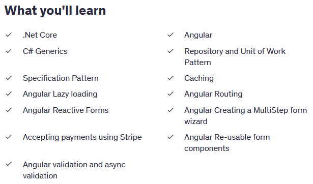

# Ski Sport DotNet

# E-Commerce App .NET & Angular

**Build a proof of concept e-commerce store using Angular, .Net and Stripe for payment processing**

**Enrolled:** **28/06/2025**

**Day 1:** 11am - 2pm - Progress Section 2 vid 9

**Module 1:**

- API Basics
- Creating the projects
- Clean architecture concepts
- Entity framework
- Docker/ SQL Server
- Postman
- Using Git for source control

**Day 1 Goal:**

- To have a working API that contains endpoints for the Create, Read, Update and Delete (CRUD) operations.
- To understand the basics of an API in .NET

**Project:** Broken down into 3 mini projects

- API - Receive HTTP requests and respond to them
- Infrastructure - Communicate with the database and send queries and get data
- Core - Contain the business entities. We do not depend on anything else.

A full stack project benefits from this breakdown by:

- separation of concerns
- Test-ability
- Scalability and maintainability
- Flexibility
- Re-usability

**Day 1: Progress Update:**

- linked GitHub repository
- Created .Net project from command line
- Created Product Entity Class
- Listed all Product field requirements for database integration
